# FoodGenome AI

**Food-101 classification with calibrated confidence, a conformal guarantee, and nutrition traced to the USDA record it came from.**

Photograph a dish and the system returns the category, a confidence figure that means what it says, the full set of candidates it cannot rule out, where it looked, and a nutrition profile you can follow back to source. It also refuses to answer questions outside what it knows, which turned out to be harder to build than answering them.

**Live:** [food-red-omega.vercel.app](https://food-red-omega.vercel.app)

| | |
|---|---|
| **97.16%** | Food-101 test top-1, on a split untouched until final evaluation |
| **99.56%** | measured conformal coverage, averaging 1.54 candidates |
| **97.94%** | accuracy on accepted images, after abstaining on 2.28% |
| **98.6%** | RAG answers correct on a 76-case gold set, 100% grounded |
| **101** | dish categories, each with a 32-nutrient USDA profile |

---

## The interface

### Landing

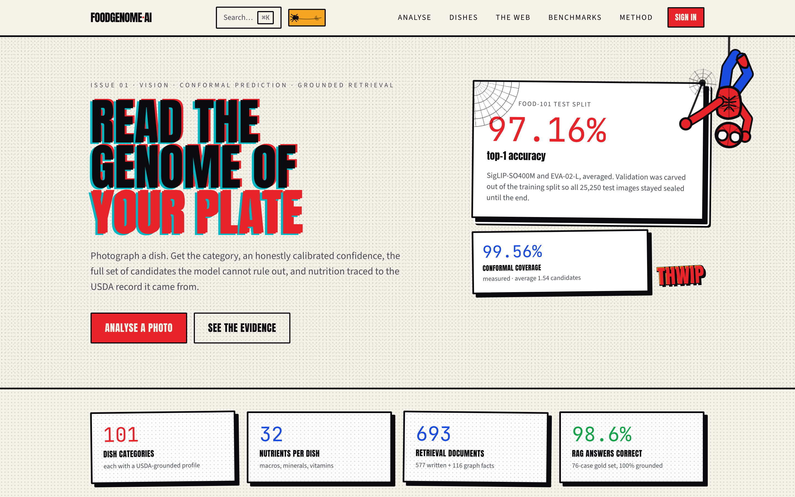

Comic-print design language: plate misregistration on display type, graded Ben-Day dots, hard-bordered panels with unblurred offset shadows. Deliberately not the gradient-mesh SaaS look.

### Analyse a photo

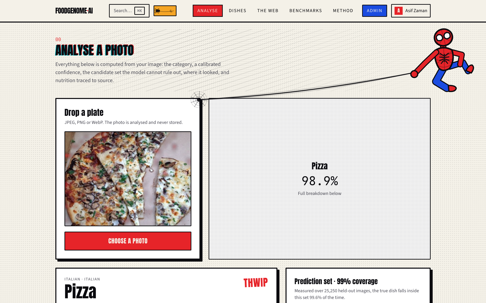

One upload returns everything at once — the prediction with its calibrated confidence, the conformal candidate set with its guarantee stated in plain language, macro and micronutrient tables, and the provenance of every figure. Composite dishes list the USDA records they were built from, each linking to FoodData Central.

### Where the model looked

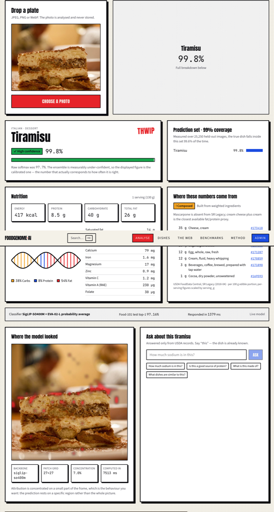

Grad-CAM over the final transformer block, back through the pooling head to the patch grid. The panel reports how *concentrated* the attribution is and changes what it claims accordingly — a map covering much of the frame is labelled diffuse, with the architectural reason. Showing a heatmap without that context invites a reader to see precision the method does not have.

### Grounded question answering

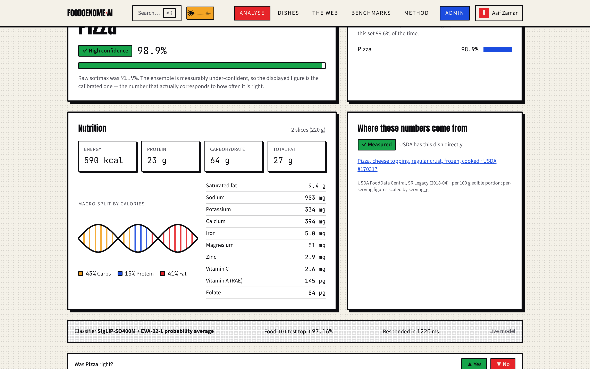

Ask in natural language. The question is rewritten to name the dish the vision model already identified, so "how much sodium is in this" can resolve against 101 near-identical sodium documents. Every quantity in the answer is verified against the retrieved sources before it is shown, and the badge states how the answer was produced.

### The knowledge web

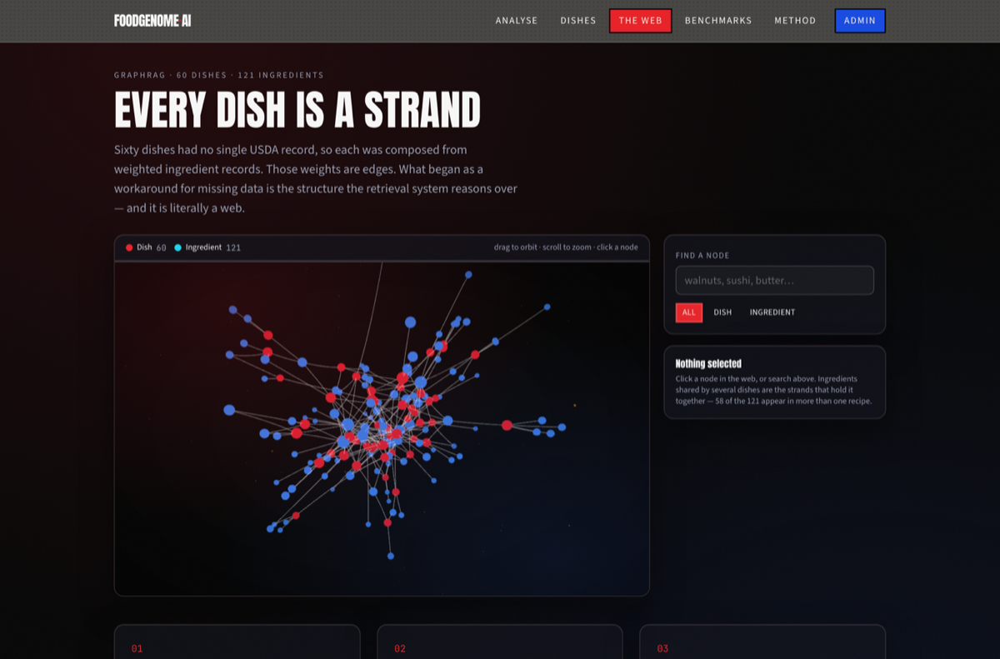

The dish → ingredient graph rendered as an actual web: 181 nodes and 323 weighted edges, all derived from real USDA composite recipes. Search by name, click to pin a node, read its neighbours with their gram weights. This answers questions no single document contains — *which dishes contain walnuts* is an inversion of sixty separate ingredient lists.

### Search anything

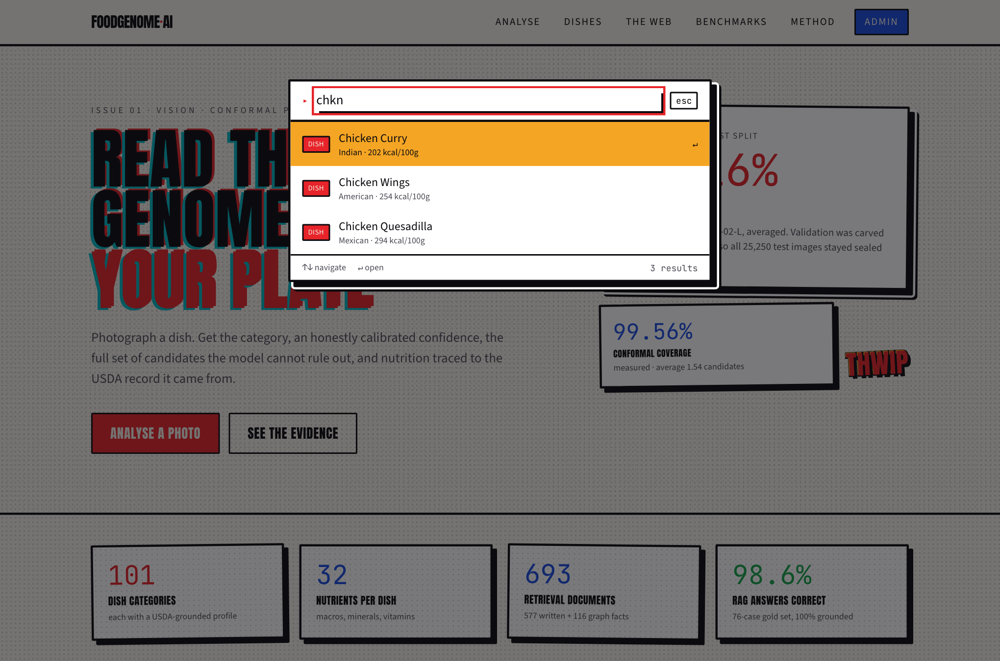

`⌘K` from any page. Matching is subsequence-based, so `chkn` finds Chicken Curry — a substring search would not, and a fuzzy-search library would be a dependency for thirty lines of scoring.

### Browse all 101 dishes

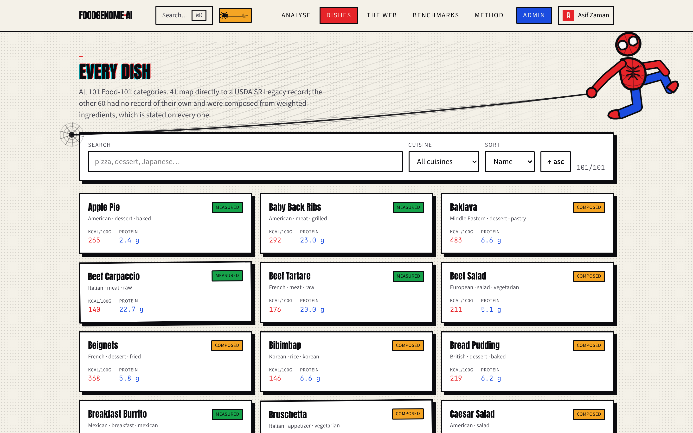

Searchable and filterable by cuisine, sortable by calories or protein. Each card states whether its figures were measured directly by USDA or composed from ingredients.

### A single dish

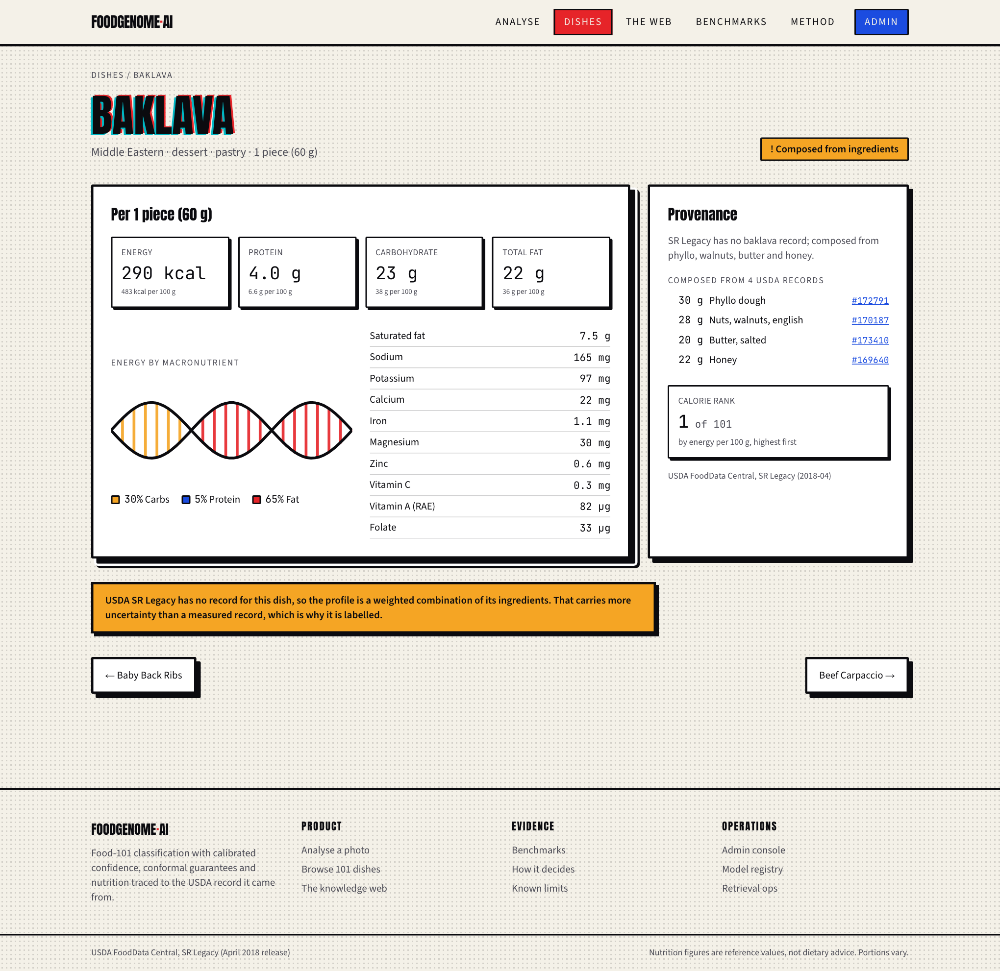

Full nutrient profile on both bases, energy split by macronutrient, the USDA records behind the numbers, and where the dish ranks against the other hundred.

### Benchmarks

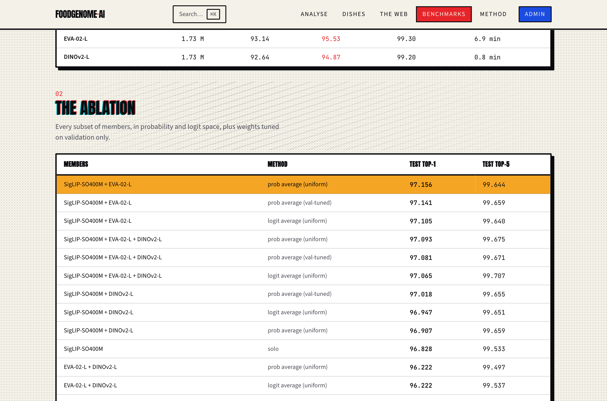

Every measured result, including the experiments that failed. Nothing here is typed in by hand — the page renders the JSON the evaluation scripts wrote.

### Method

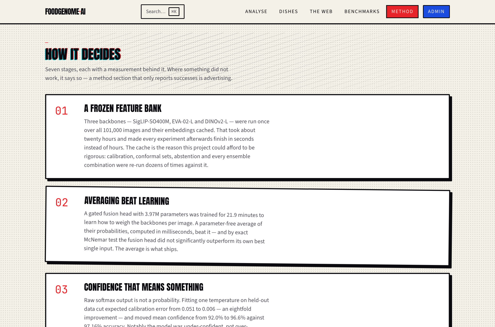

Seven stages with a measurement behind each, followed by a section on what the system *cannot* do.

---

## The admin console

### Overview

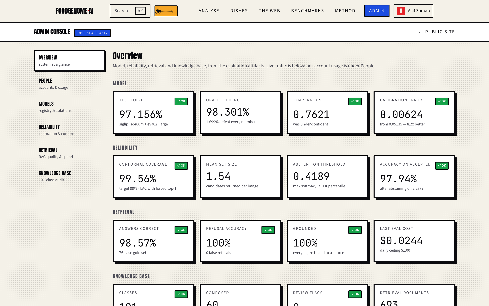

Model, reliability, retrieval and knowledge-base health, each tile linking to its evidence. Metrics that are not yet instrumented are listed as pending rather than mocked — a dashboard showing invented traffic is worse than one admitting it has none.

### Model registry

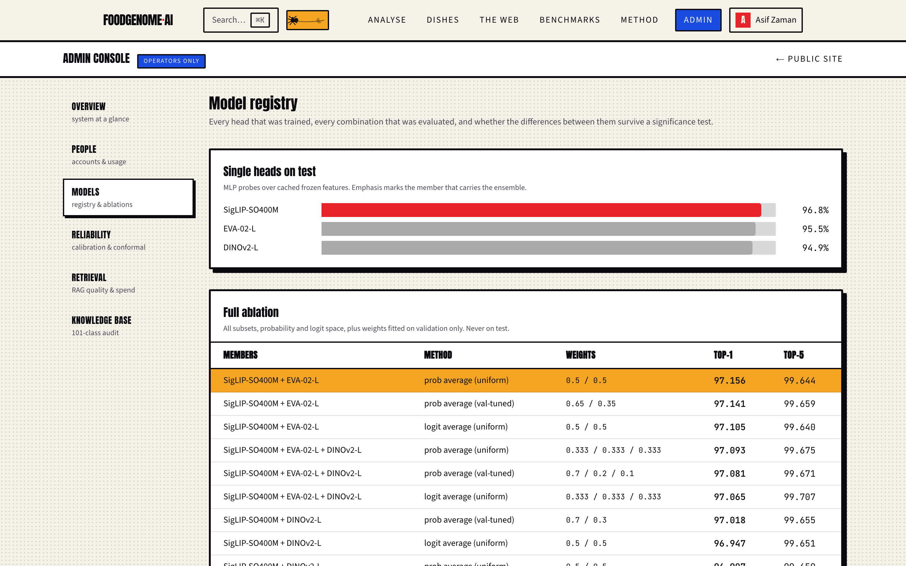

Every head trained, the full ablation, and exact McNemar tests on the differences between them.

### Reliability

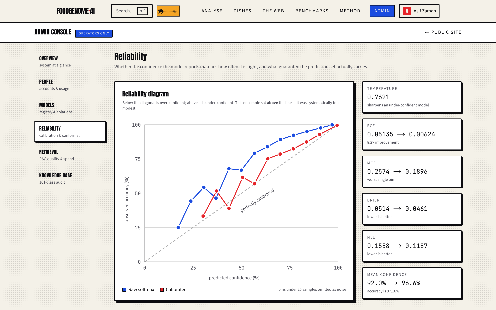

A reliability diagram plotting raw against calibrated confidence, with the diagonal a perfect model sits on. Below it, conformal coverage and set size for four methods at three targets.

### Retrieval operations

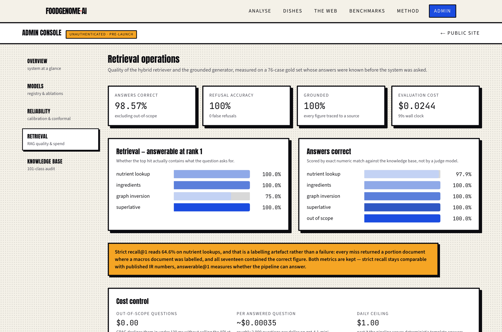

Retrieval and answer quality by question category, plus cost control.

---

## Three results that ran against expectation

**A parameter-free average beat a trained fusion head.** A 3.97M-parameter gated fusion model, trained for 21.9 minutes, lost to a probability average computed in milliseconds — and by exact McNemar test it did not significantly outperform its own best single input.

**A third backbone earned no place.** DINOv2-L was expected to decorrelate from the others, being the only self-supervised member. It is the *most* correlated: 66.3% of SigLIP's errors are shared with it. Adding it made the ensemble marginally worse.

**Attention is not saliency.** Reading the pooling head's own attention weights should be the most faithful account of where a model looked. Measured against a border-mass baseline it is *worse than chance* at finding the food — reproducing the documented artefact where transformers park high attention on empty background patches.

---

## How it works

```mermaid
%%{init: {'theme':'base','themeVariables':{
  'fontFamily':'ui-sans-serif, system-ui, sans-serif','fontSize':'14px',
  'primaryColor':'#ffffff','primaryTextColor':'#0b0b0f','primaryBorderColor':'#0b0b0f',
  'lineColor':'#4b4b55'},
  'flowchart':{'curve':'basis','padding':22,'nodeSpacing':34,'rankSpacing':60}}}%%
flowchart LR
    IMG(["photograph"])
    S["SigLIP-SO400M · 96.83%"]
    E["EVA-02-L · 95.53%"]
    AVG{{"probability average · 97.16%"}}
    CAL["temperature T = 0.7621"]
    CONF["conformal set · 99.56% coverage"]
    AB{"model confident?"}
    NUT["USDA nutrition · 101 classes"]
    OUT(["dish · confidence · candidates"])
    LOST(["declines — the model is lost"])

    IMG --> S & E
    S & E --> AVG --> CAL --> CONF --> AB
    AB -- "yes" --> NUT --> OUT
    AB -- "no" --> LOST

    classDef vision fill:#e62429,stroke:#0b0b0f,stroke-width:2px,color:#ffffff
    classDef rel fill:#1b4ce0,stroke:#0b0b0f,stroke-width:2px,color:#ffffff
    classDef know fill:#0e8fa3,stroke:#0b0b0f,stroke-width:2px,color:#ffffff
    classDef gate fill:#f5a524,stroke:#0b0b0f,stroke-width:2px,color:#0b0b0f
    classDef term fill:#ffffff,stroke:#0b0b0f,stroke-width:3px,color:#0b0b0f
    classDef refuse fill:#0b0b0f,stroke:#0b0b0f,stroke-width:2px,color:#f4f1e8

    class S,E,AVG vision
    class CAL,CONF rel
    class NUT know
    class AB gate
    class IMG,OUT term
    class LOST refuse
```

<sub>**red** vision · **blue** reliability · **teal** knowledge · **amber** a decision that can refuse</sub>

Ask a question about the identified dish and a second pipeline runs, which can refuse in two more places:

```mermaid
%%{init: {'theme':'base','themeVariables':{
  'fontFamily':'ui-sans-serif, system-ui, sans-serif','fontSize':'14px',
  'primaryColor':'#ffffff','primaryTextColor':'#0b0b0f','primaryBorderColor':'#0b0b0f',
  'lineColor':'#4b4b55'},
  'flowchart':{'curve':'basis','padding':22,'nodeSpacing':34,'rankSpacing':58}}}%%
flowchart LR
    Q(["how much sodium is in this?"])
    RW["rewrite to name the dish"]
    HYB["BM25 + bi-encoder"]
    RRF["reciprocal rank fusion"]
    RR["cross-encoder rerank"]
    CRAG{"evidence relevant?"}
    GEN["generate from sources only"]
    GATE{"every number in a source?"}
    ANS(["answer with citations"])
    TPL(["the record itself, verbatim"])
    NONE(["outside the knowledge base"])

    Q --> RW --> HYB --> RRF --> RR --> CRAG
    CRAG -- "yes" --> GEN --> GATE
    CRAG -- "no" --> NONE
    GATE -- "yes" --> ANS
    GATE -- "no" --> TPL

    classDef prep fill:#0e8fa3,stroke:#0b0b0f,stroke-width:2px,color:#ffffff
    classDef gate fill:#f5a524,stroke:#0b0b0f,stroke-width:2px,color:#0b0b0f
    classDef term fill:#ffffff,stroke:#0b0b0f,stroke-width:3px,color:#0b0b0f
    classDef refuse fill:#0b0b0f,stroke:#0b0b0f,stroke-width:2px,color:#f4f1e8

    class RW,HYB,RRF,RR,GEN prep
    class CRAG,GATE gate
    class Q,ANS,TPL term
    class NONE refuse
```

A failed grounding check does not refuse — it serves the retrieved record verbatim, which is correct by construction and needs no verification.


Two paths lead to a refusal, and that is deliberate. The abstention gate declines when the model is lost on the image; the CRAG gate declines when the knowledge base holds nothing relevant. A failed grounding check does not refuse — it falls back to the deterministic record, which is correct by construction.

### Where the accuracy actually comes from

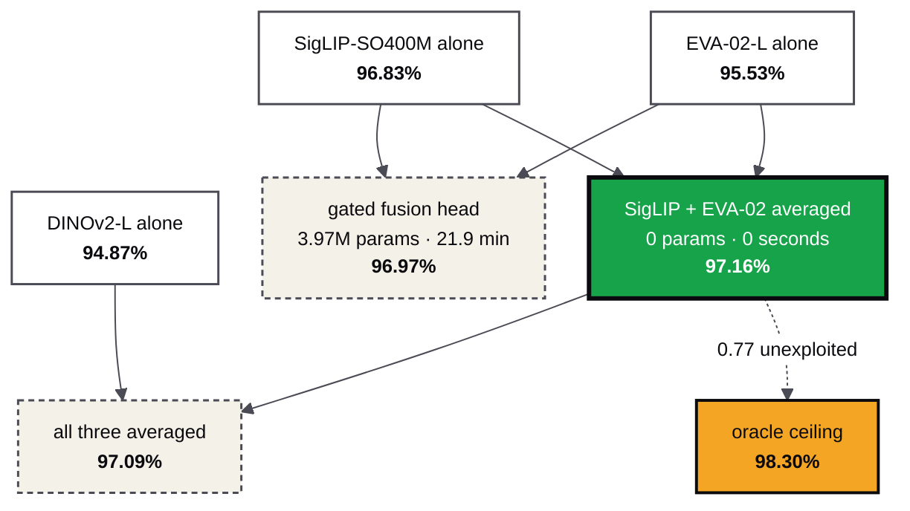

The winner has no parameters. The trained fusion head and the three-way average both lost to it, and neither loss is explained by noise — the pairing beats its best single input at p = 0.000003.


**Vision.** Three backbones were run once over all 101,000 images and their embeddings cached — about twenty hours, after which every downstream experiment finished in seconds. Lightweight MLP probes train on the cache; the shipped classifier averages two of them.

**Reliability.** Temperature fitted on held-out data cut expected calibration error eightfold. Split-conformal prediction gives a coverage guarantee that holds without assuming anything about the model. Abstention combines calibrated confidence with conformal set size, because neither is sufficient alone.

**Retrieval.** 693 documents — 577 written from the knowledge base plus 116 graph facts — indexed for both lexical and semantic search, fused by Reciprocal Rank Fusion, reranked by a cross-encoder, and conditioned on the dish the vision model identified.

**Grounding.** Every quantity in a generated answer must appear in the retrieved context, matched per unit so milligrams can never be supported by the same digits in grams. An answer that fails is withheld, not annotated.

---

## Repository

```
src/nutrivision/
  data/         Food-101 download and the fixed validation split
  models/       backbone feature extraction, probe heads
  training/     probe training, ensembling, fine-tuning
  reliability/  temperature scaling, split-conformal prediction
  explain/      Grad-CAM and attribution comparison
  nutrition/    USDA resolution and the 101-class knowledge base
  rag/          corpus, index, retrieval, graph, generation, grounding, evaluation
backend/        FastAPI service and its container
web/            Next.js frontend
notebooks/      Kaggle fine-tuning notebook
docs/           architecture, design system, proposal
```

### Running it

```bash
# Python environment
python -m venv .venv && .venv/bin/pip install -e .

# Build the knowledge base, corpus and retrieval index
.venv/bin/python -m nutrivision.nutrition.build_kb
.venv/bin/python -m nutrivision.rag.corpus
.venv/bin/python -m nutrivision.rag.index

# Serve the model
.venv/bin/python -m uvicorn backend.app.main:app --port 8000

# Frontend
cd web && npm install && FOODGENOME_API=http://127.0.0.1:8000 npm run dev
```

Copy `.env.example` to `.env` for the OpenAI key. Without it the RAG pipeline serves deterministic template answers assembled from the same records — correct by construction, and free.

### Evaluation

```bash
.venv/bin/python -m nutrivision.training.ensemble          # ablation + McNemar
.venv/bin/python -m nutrivision.reliability.calibration \
    --name ensemble --members siglip_so400m eva02_large
.venv/bin/python -m nutrivision.reliability.conformal      # coverage vs set size
.venv/bin/python -m nutrivision.rag.evaluate               # retrieval + answers
```

---

## Methodology

Food-101 ships only train and test splits. A fixed 4% class-stratified validation slice is carved out of **train** (seed 1337) and shared by every pipeline; the 25,250-image test split stays untouched until final evaluation. Reporting model-selection numbers on test is the most common way projects like this overstate themselves.

Nutrition figures are USDA reference values for a typical serving. Real portions vary, and this is not dietary advice.

**Data:** [Food-101](https://data.vision.ee.ethz.ch/cvl/datasets_extra/food-101/) · [USDA FoodData Central, SR Legacy](https://fdc.nal.usda.gov/)
