# FoodGenome AI — Architecture

Every diagram below reflects what is actually built or specified, with measured numbers
where measurements exist. Nothing here is aspirational unless marked *planned*.

---

## 1. System overview

The whole product in one view: a photograph enters on the left, a grounded nutritional
answer leaves on the right, and every gate in between exists because a wrong answer in a
nutrition app is worse than no answer.

**Legend** — 🔵 client (Vercel) · 🔴 backend (HF Spaces) · 🟢 knowledge (local, zero cost) ·
🟠 external services

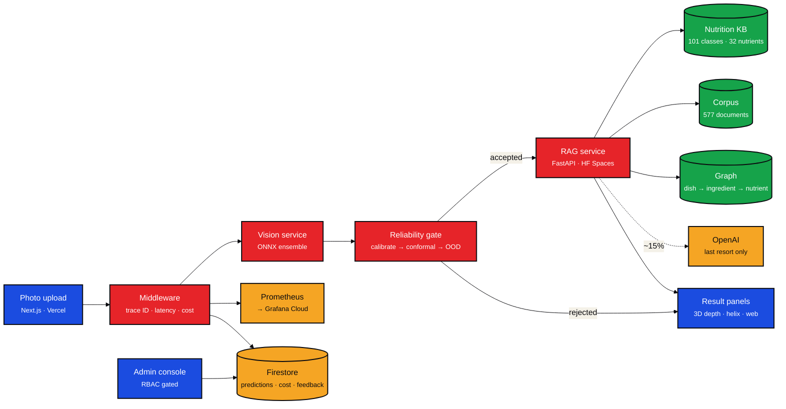

---

## 2. Training pipeline — the frozen feature bank

The central engineering decision. Running each backbone over the corpus **once** and
caching pooled embeddings converts every downstream experiment from hours into seconds,
which is what makes rigorous ablation affordable on a laptop.

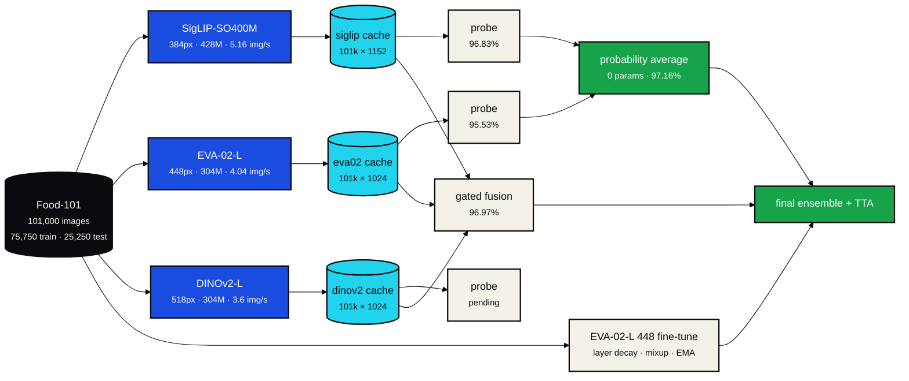

### Measured results

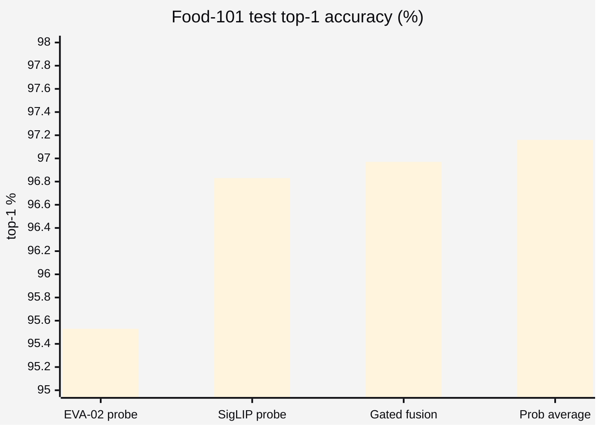

**The learned fusion head lost to a parameter-free average.** McNemar exact test on paired
test predictions (n = 25,250): prob-average vs gated-fusion **p = 0.0050 (significant)**,
while gated-fusion vs SigLIP alone was **p = 0.071 (not significant)** — the 3.97M-parameter
head failed to beat its own best input.

---

## 3. Why the ensemble gains are small

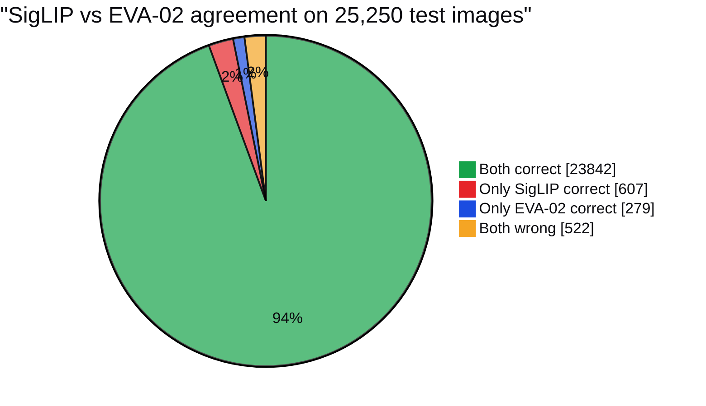

65.2% of SigLIP's errors are *also* EVA-02's errors. The oracle ceiling — either model
correct — is **97.93%**, so roughly 0.8 points of headroom remain unexploited. This is why
DINOv2 matters disproportionately: as the only self-supervised member it should be the
least correlated with the other two.

---

## 4. Knowledge base construction

Naive text matching against USDA fails **confidently**, which is the dangerous failure
mode: beef carpaccio → "Soup, stock, beef" at 13 kcal, chicken wings → "Soup, stock,
chicken" at 36 kcal.

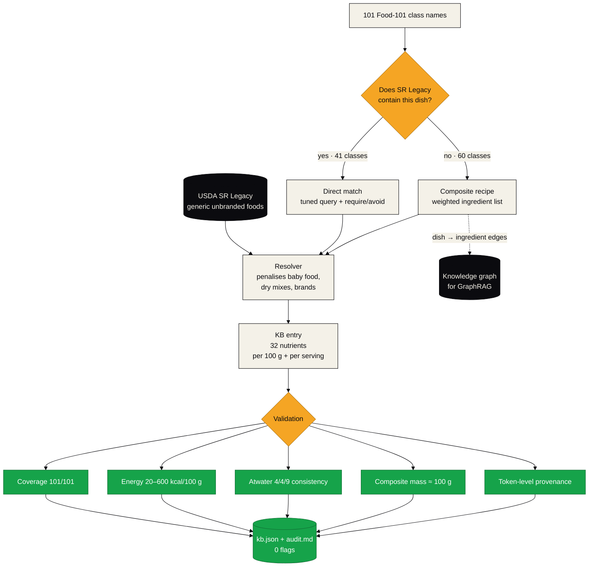

> **A validator that shares the failure mode of the thing it validates is worse than no
> validator.** The ingredient query `"water"` substring-matched **"Watermelon, raw"**,
> putting watermelon into miso soup, churros and takoyaki. No numeric check caught it —
> watermelon is low-calorie enough to stay in band — and the *first* provenance check
> written to catch it had the same substring flaw and passed it too. Provenance now compares
> whole tokens.

---

## 5. Advanced RAG — the LLM is the last resort

Cost and correctness point the same way: a deterministic KB lookup is *more* accurate than
an LLM for numeric facts, because a model reading "310 kcal" from context can transcribe it
wrong and a lookup cannot.

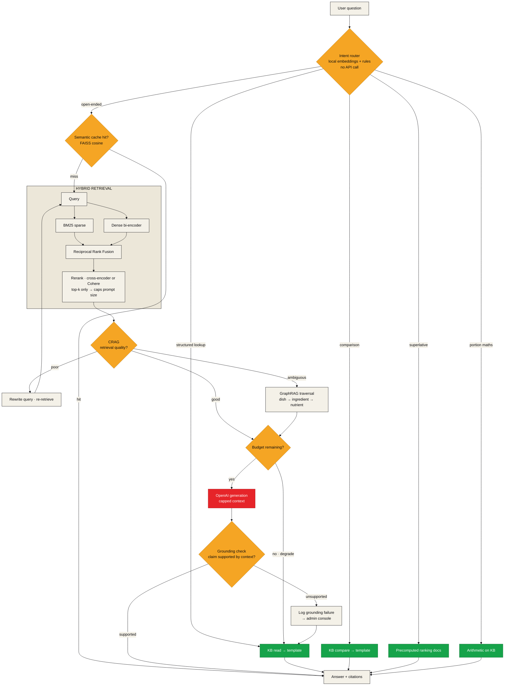

**~85% of traffic never reaches OpenAI.** Controls on the remainder: semantic answer cache,
hard daily budget that degrades to templates rather than erroring, context capped to
reranked top-k, prompt-prefix caching, and the Batch API for offline evaluation.

The shipped subset of this design lives in `src/nutrivision/rag/`: the retrieval stages are
LangChain retrievers and a document compressor, and the control flow — CRAG gate, relaxed
retry, budget gate, grounding check, template fallback — is a compiled LangGraph in
`pipeline.py`. `python -m nutrivision.rag.pipeline --graph` prints what is actually wired.

---

## 6. Reliability gate

Accuracy alone is an insufficient goal. This is the decision flow between a raw prediction
and anything shown to a user.

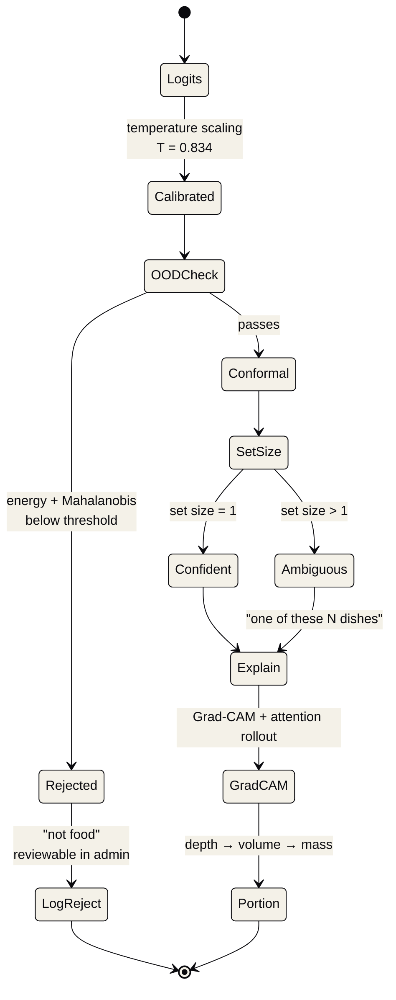

Calibration measured on the SigLIP head: **ECE 0.03250 → 0.00425** (7.6× better), accuracy
byte-identical at 96.828 — temperature scaling cannot move the arg-max, which is the
correctness check. The fitted **T = 0.834 is below 1**, meaning the model was *under*-confident,
the opposite of the textbook result, traced to stacking label smoothing with mixup.

---

## 7. Request lifecycle

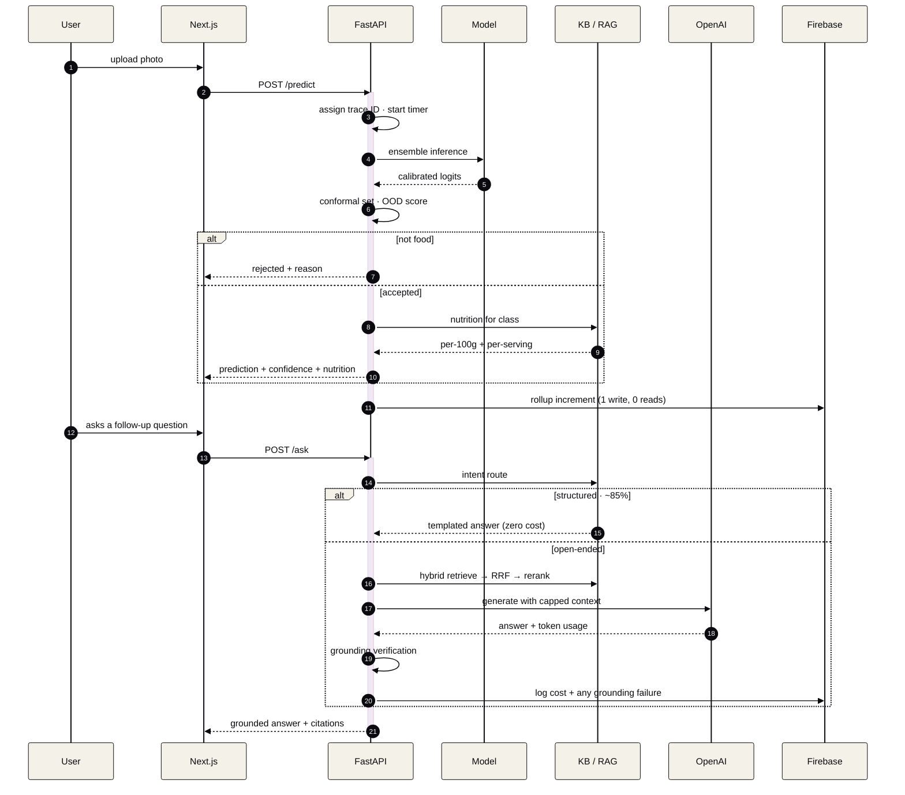

---

## 8. Firestore schema

Firestore bills **per document read**, and the free tier allows ~50k reads/day. An admin
dashboard reading raw rows would exhaust that in minutes, so metrics are written as
pre-aggregated rollups updated with atomic increments.

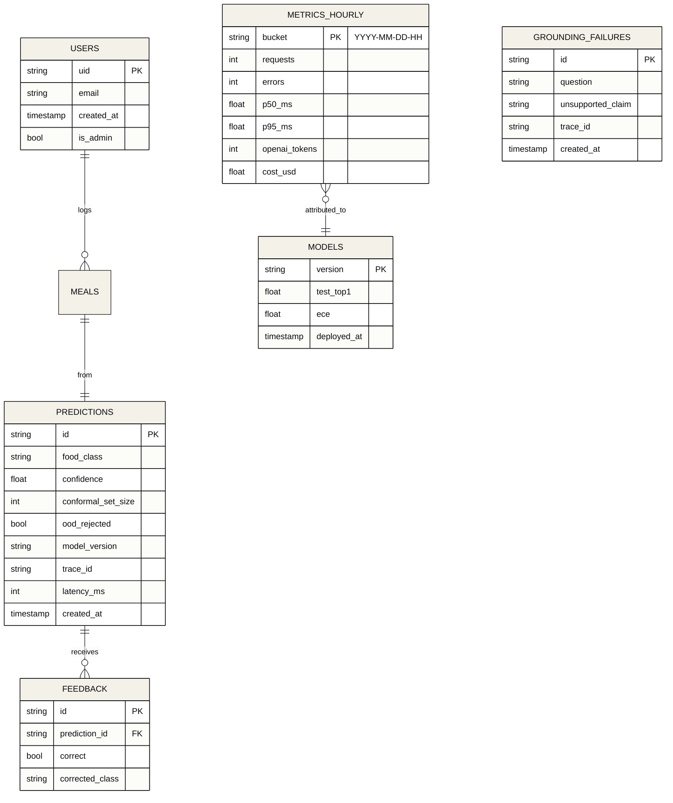

**One write per request, zero reads.** A full day of dashboard data is 24 documents rather
than tens of thousands.

---

## 9. Deployment topology

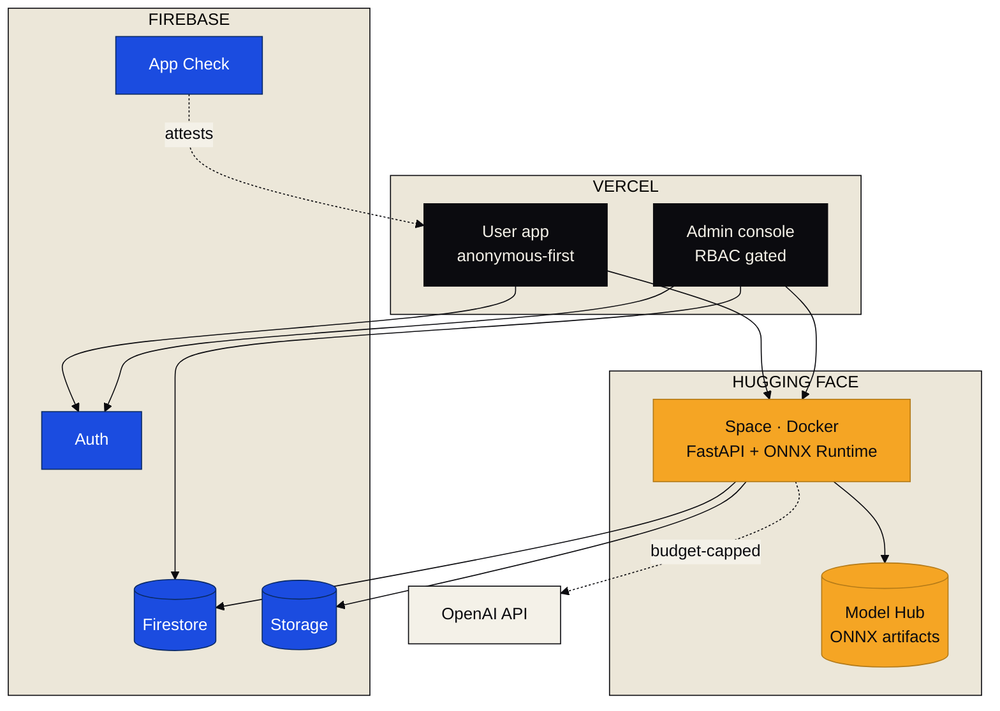

---

## 10. Delivery plan

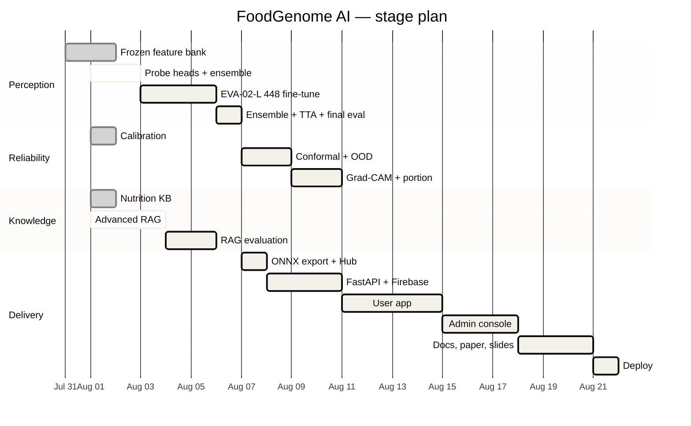
